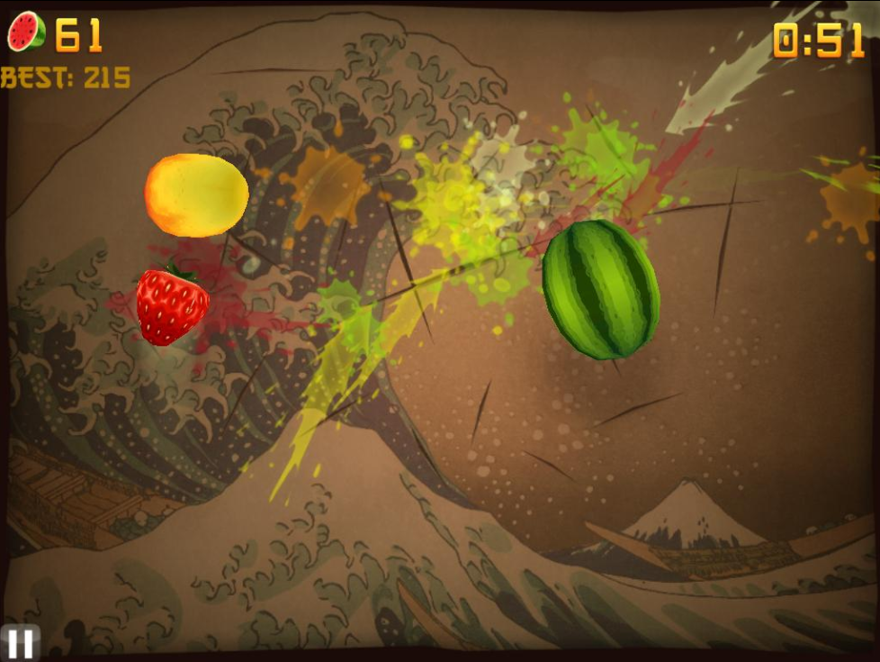
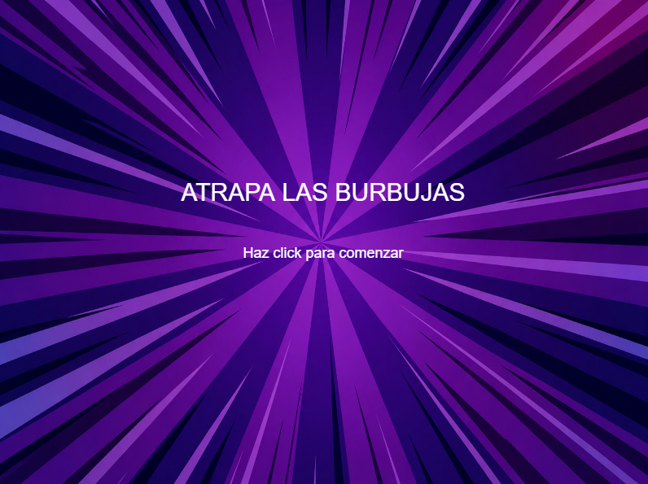
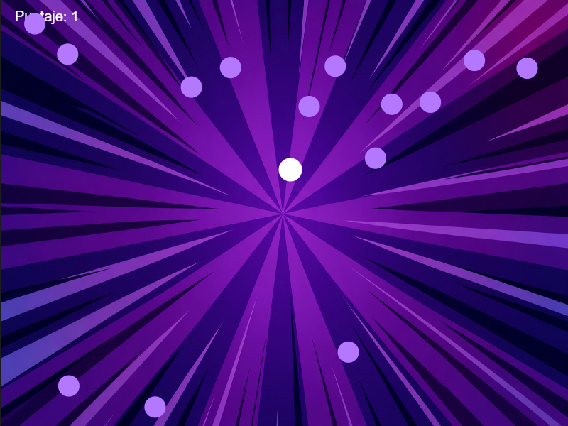
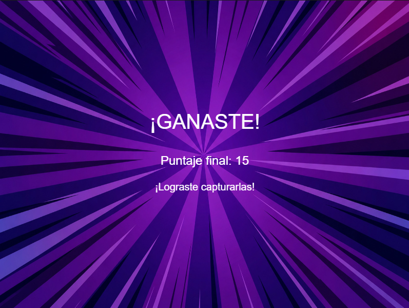
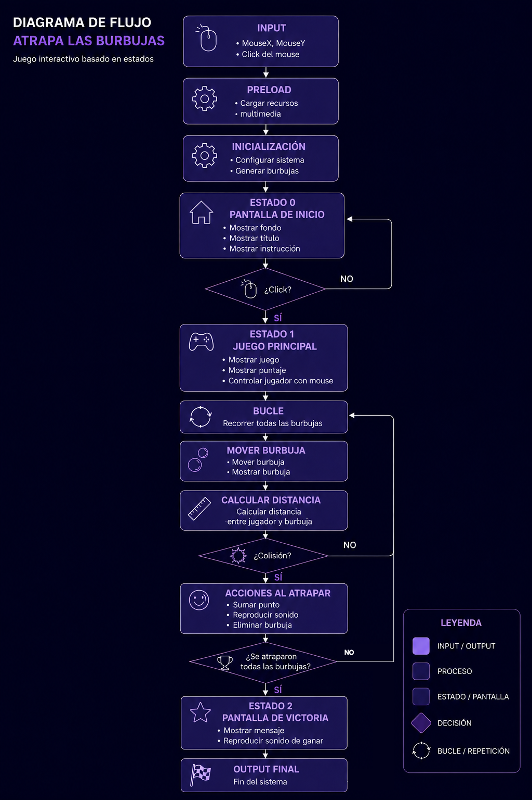

# Examen-Final-Pensamiento-Computacional
# Atrapa las Burbujas
Proyecto desarrollado para el Examen Final de Pensamiento Computacional.
Consiste en un sistema interactivo programado en p5.js que utiliza estados, eventos, variables, condicionales, bucles, funciones, multimedia e interacción mediante mouse para generar una experiencia lúdica basada en la captura de burbujas y la obtención de puntaje.

**Autora:** Javiera Ortega

# Link del proyecto

### Sketch en p5.js

https://editor.p5js.org/javiera.ortega5/sketches/-kd2gywp-

---

# Concepto

Atrapa las Burbujas es un juego interactivo basado en estados donde el usuario debe capturar una serie de burbujas que se desplazan por la pantalla. El sistema combina movimiento aleatorio, detección de colisiones y retroalimentación visual y sonora para generar una experiencia simple pero dinámica.

La propuesta busca demostrar cómo distintas reglas computacionales pueden utilizarse para construir una experiencia interactiva mediante el uso de variables, condicionales, funciones, bucles y elementos multimedia.

---

# Referente e inspiración

La propuesta se inspira en Fruit Ninja, un juego arcade que utiliza una mecánica de interacción rápida donde el jugador debe actuar sobre distintos elementos que aparecen en pantalla para obtener puntaje. Al igual que ese referente, este proyecto busca generar una experiencia simple, dinámica y de aprendizaje inmediato mediante la relación entre las acciones del usuario y la respuesta del sistema.

En Atrapa las Burbujas, esta mecánica se adapta utilizando el mouse para capturar burbujas en movimiento. Cada captura entrega retroalimentación visual y sonora, aumenta el puntaje del jugador y acerca al objetivo final del juego. De esta forma, la propuesta reinterpretó la lógica de interacción de Fruit Ninja mediante un sistema basado en estados, variables, condicionales, funciones y detección de colisiones.

## Imagen referente

 
---

# Inputs del sistema

| Input           | Función                                     |
| --------------- | ------------------------------------------- |
| MouseX          | Controla la posición horizontal del jugador |
| MouseY          | Controla la posición vertical del jugador   |
| Click del mouse | Inicia la partida                           |

---

# Estados del sistema

## Estado 0 — Pantalla de inicio

* Mostrar fondo.
* Mostrar título.
* Mostrar instrucciones.
* Esperar interacción del usuario.

### Captura

 

---

## Estado 1 — Juego principal

* Mostrar jugador.
* Mostrar puntaje.
* Mover burbujas.
* Detectar colisiones.
* Reproducir sonidos al capturar.

### Captura

 

---

## Estado 2 — Pantalla de victoria

* Mostrar mensaje final.
* Mostrar puntaje obtenido.
* Reproducir sonido de victoria.

### Captura

 

---

# Procesos computacionales

## random()

La función random() se utiliza para generar posiciones iniciales aleatorias para las burbujas y para producir pequeñas variaciones en su movimiento durante el juego.

### Código

```javascript
x[i] = random(width);
y[i] = random(height);
```

---

## dist()

La función dist() calcula la distancia entre el jugador y cada burbuja para detectar colisiones.

### Código

```javascript
let distancia = dist(
  mouseX,
  mouseY,
  x[i],
  y[i]
);
```

---

## map()

La función map() transforma el puntaje en el tamaño del jugador. A medida que aumenta el puntaje, el jugador crece.

### Código

```javascript
let tamJugador = map(
  puntaje,
  0,
  10,
  30,
  60
);
```

---

# Diagrama de flujo

El siguiente diagrama representa el funcionamiento general del sistema y la relación entre inputs, procesos, decisiones y estados.

     
---

# Proceso de desarrollo

## Boceto inicial

[Insertar imagen]

Descripción breve del planteamiento inicial del proyecto.

---

## Desarrollo

[Insertar imagen]

Pruebas de funcionamiento, detección de colisiones y ajustes de interacción.

---

## Resultado final

[Insertar imagen]

Versión final implementada en p5.js.

---

# Herramientas utilizadas

* p5.js
* JavaScript
* GitHub

---

# Reflexión final

Este proyecto permitió aplicar diversos conceptos vistos durante el curso, incluyendo estados, variables, funciones, bucles, condicionales e interacción mediante inputs del usuario.

Uno de los principales desafíos fue organizar correctamente la lógica del sistema utilizando distintos estados para controlar cada etapa de la experiencia. También fue necesario implementar mecanismos de detección de colisiones y relacionar distintos elementos visuales y sonoros para entregar una retroalimentación clara al usuario.

La experiencia permitió comprender cómo reglas computacionales relativamente simples pueden combinarse para construir sistemas interactivos completos y coherentes. Si se continuara desarrollando el proyecto, podrían incorporarse nuevos niveles, temporizadores o distintos tipos de burbujas para aumentar la complejidad del juego.

---
